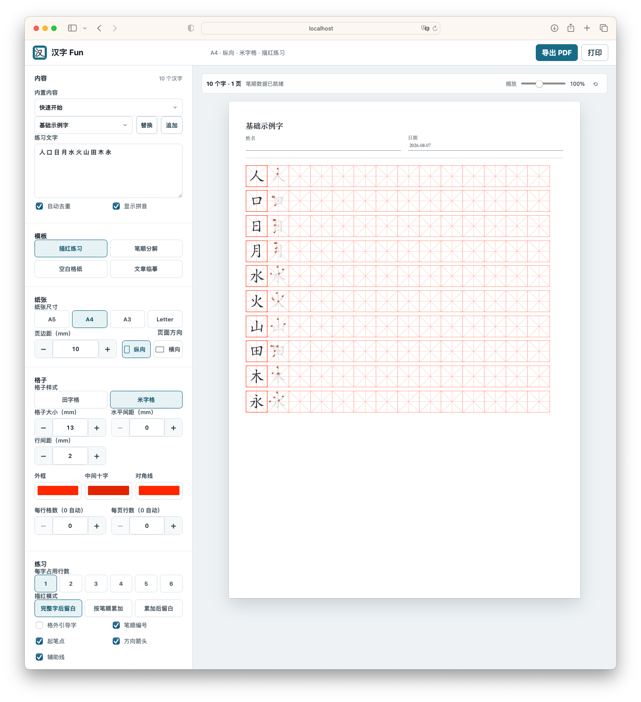
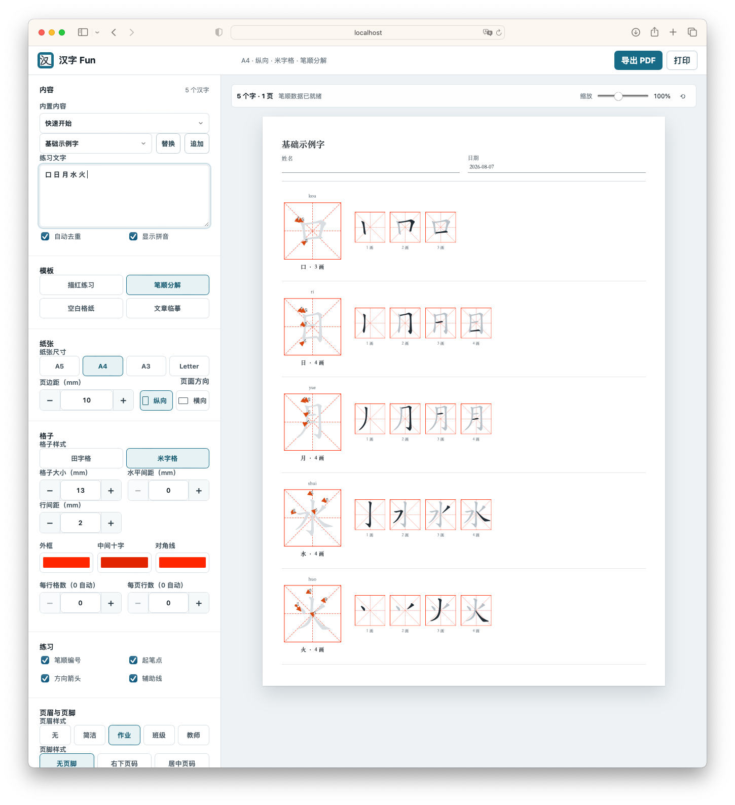
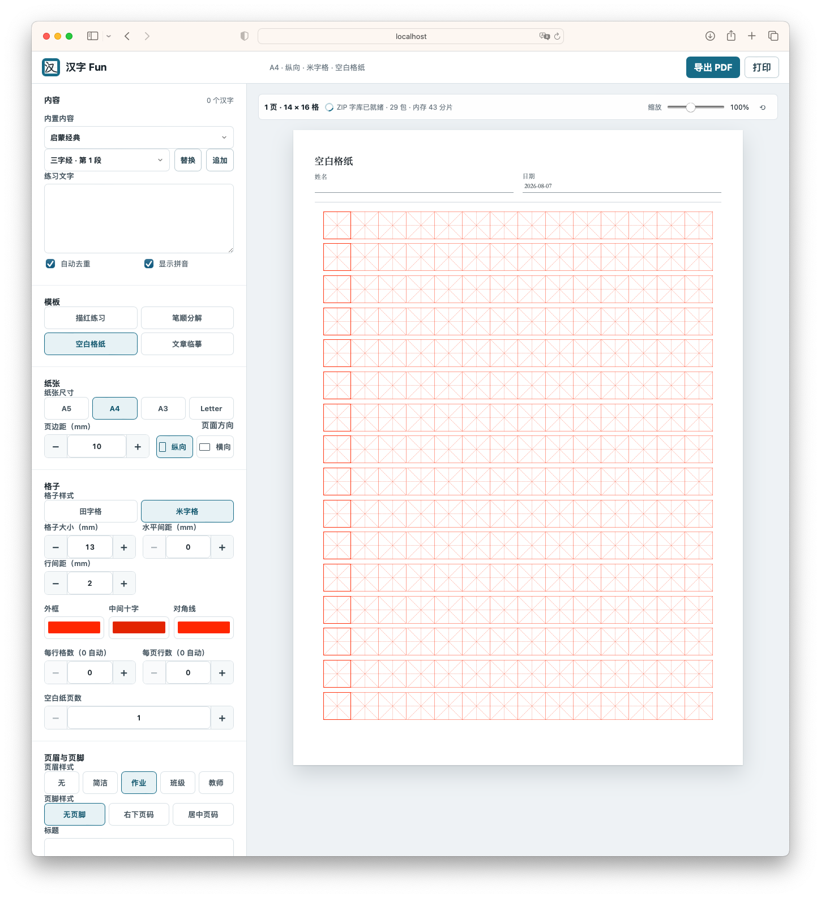
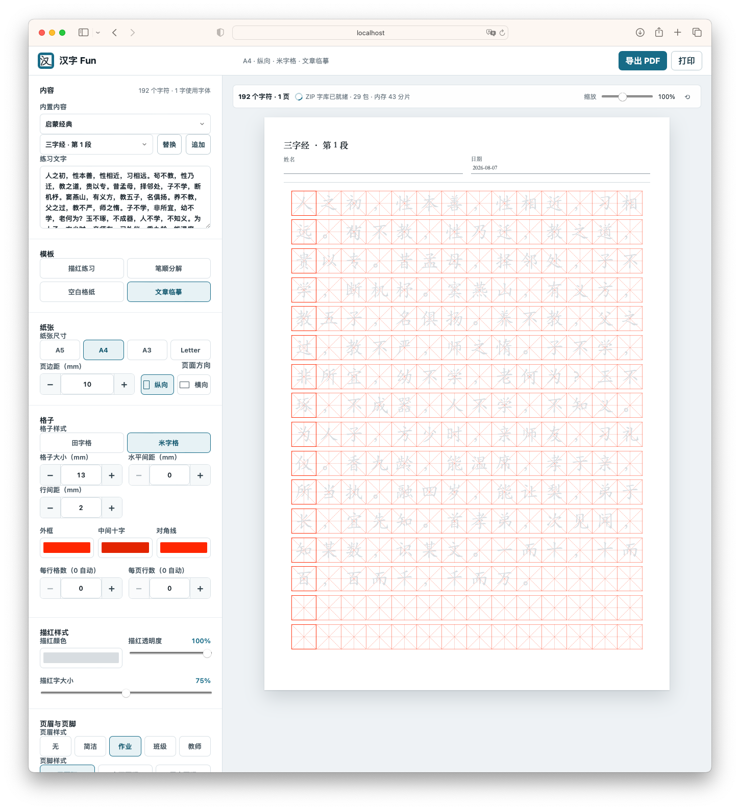
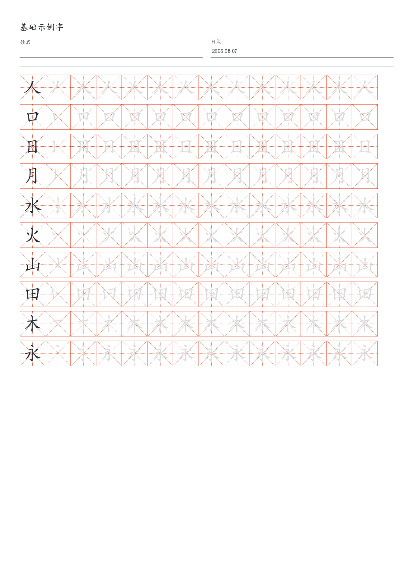

# 汉字 Fun

离线可用的中文写字练习本生成器。输入汉字，选择模板，即时预览，一键打印或导出 PDF。

**在线使用**：<https://rickytan.cn/HanZiFun/>

## 截图

### 描红练习

输入生字后自动生成描红练习页，第一格为描红示范字，后续为空白练习格。支持完整字和按笔顺累加两种描红模式。



### 笔顺分解

逐笔展示汉字的书写顺序，包含笔顺编号、起笔点和方向箭头，适合学习新字。



### 空白格纸

生成纯田字格或米字格空白练习纸，可自定义格子大小、间距和页数。



### 文章临摹

输入古诗或短文，自动提取汉字并逐字生成临摹练习页，保留原文顺序。



### PDF 导出

点击"导出 PDF"生成多页 PDF 文件，使用 jsPDF 本地生成，不依赖网络。PDF 内嵌楷体子集字体，确保汉字正确渲染。



## 功能特性

- **4 种练习模板**：描红练习、笔顺分解、空白格纸、文章临摹
- **2 种格子样式**：田字格、米字格
- **全量字符覆盖**：9574 个单码点汉字笔顺数据（源自 [hanzi-writer-data](https://github.com/chanind/hanzi-writer-data)，基于 Make Me A Hanzi）
- **按需加载**：首屏预载 28 个基础字，其余按 250 字拆分为 ZIP 小包，浏览时只下载命中的包并按条目解压
- **内置内容模板**：唐诗 100 首、三字经全文与分段、诗经选读、小学常用 3500 字分段、基础结构字组
- **多纸张支持**：A5 / A4 / A3 / Letter，纵向 / 横向，毫米级精确排版
- **所见即所得**：所有设置实时更新预览，无需手动生成
- **PDF 导出**：本地 jsPDF 生成，内嵌子集化楷体字体，支持多页
- **打印支持**：桌面端浏览器打印，移动端自动检测 `window.print()` 支持并 fallback 到 PDF 下载
- **离线可用**：PWA + Service Worker 缓存，安装到桌面后完全离线运行
- **CDN 加速**：笔顺数据 ZIP 包通过 jsDelivr CDN 分发，文件名包含内容哈希实现精准缓存
- **移动端适配**：响应式布局，设置抽屉，触屏友好控件

## 技术栈

| 层面 | 技术 |
|------|------|
| 运行时 | 原生 HTML / CSS / JavaScript，无框架 |
| 样式 | Tailwind CSS v4（构建期生成，运行时零依赖）+ 自定义 `style.css` |
| 笔顺渲染 | SVG path + 笔顺编号 / 起笔点 / 方向箭头 |
| PDF 生成 | jsPDF（本地 vendored），原生 PDF path / text 原语，内嵌 hb-subset 子集化楷体 |
| ZIP 解压 | fflate（本地 vendored），按条目选择性解压 |
| 数据分发 | jsDelivr CDN + GitHub Pages，Service Worker 缓存 |
| 构建 | Node.js 脚本（esbuild 压缩 JS、html-minifier-terser 压缩 HTML、Tailwind CLI 生成 CSS） |
| 部署 | GitHub Actions → GitHub Pages |

## 本地运行

```bash
npm install
npm run dev
```

访问 <http://localhost:8765/>

也可以直接双击 `index.html` 打开（基础功能可用，PWA 需要 HTTP 服务）。

## 构建

```bash
npm run check   # 语法检查 + Service Worker 测试
npm run build   # 完整生产构建，输出 dist/
```

`npm run build` 依次完成：生成 Tailwind CSS → PWA 图标 → vendor 资源（fflate / jsPDF / 楷体子集字体）→ 笔顺数据（ZIP 包 + 分块脚本 + 索引 + 拼音）→ 压缩 HTML / CSS / JS → 输出 `dist/`。

## 项目结构

```
HanZiFun/
├── index.html              # 入口
├── app.js                  # 应用逻辑
├── style.css               # 域样式（纸张、打印、SVG）
├── service-worker.js       # PWA 离线缓存
├── src/tailwind.css         # Tailwind 源文件
├── data/
│   ├── strokes.js           # 预载 28 核心字
│   ├── stroke-index.js      # 字符→分片索引 + ZIP 包信息
│   ├── strokes-pack-NNN-*.zip  # 笔顺数据包（内容哈希文件名）
│   ├── content-templates.js # 内置内容模板
│   └── pinyin.js            # 拼音表
├── vendor/                  # 本地化依赖（fflate / jsPDF / hb-subset / 楷体）
├── scripts/                 # 构建脚本
├── PRD.md                   # 产品需求文档
├── DESIGN.md                # 设计哲学与视觉规范
└── NOTICE.md                # 数据来源与许可声明
```

## 相关文档

- [PRD.md](PRD.md) — 产品需求文档（产品目标、使用场景、功能规格、验收标准）
- [DESIGN.md](DESIGN.md) — 设计哲学与视觉规范
- [NOTICE.md](NOTICE.md) — 数据来源与开源许可声明
- [AGENTS.md](AGENTS.md) — AI 协作指南

## 许可

笔顺数据源自 [hanzi-writer-data](https://github.com/chanind/hanzi-writer-data)（基于 [Make Me A Hanzi](https://github.com/skishore/makemeahanzi)，MIT 许可）。楷体字体源自 [AR PL UKai CN](https://www.freedesktop.org/wiki/Software/CJKUnifonts/)（Arphic 公共许可）。详见 [NOTICE.md](NOTICE.md)。
